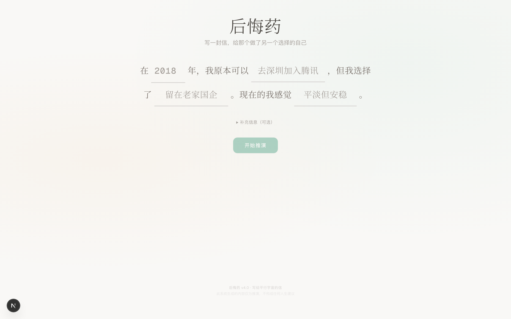
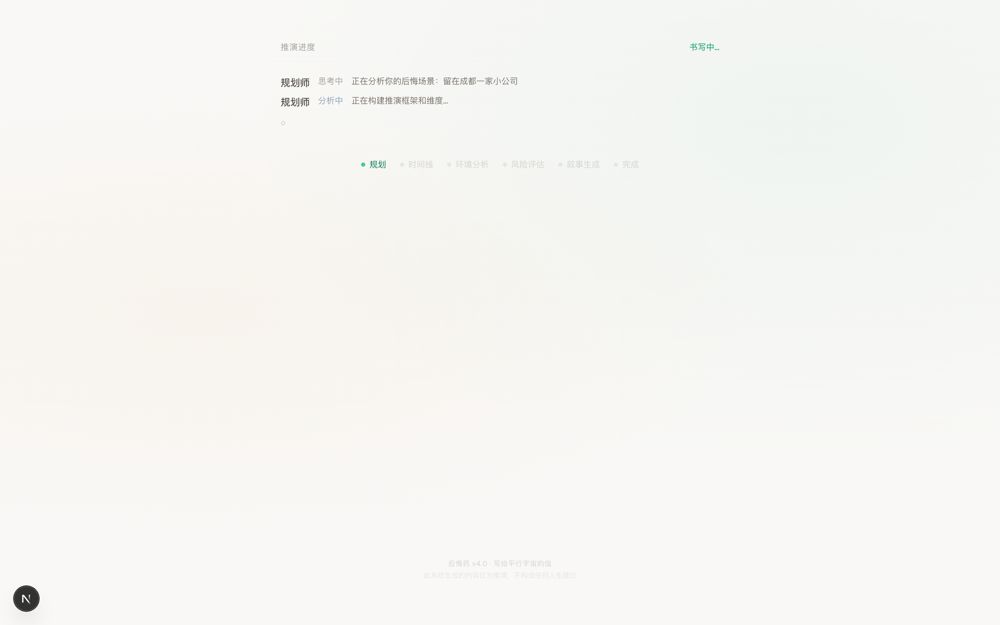
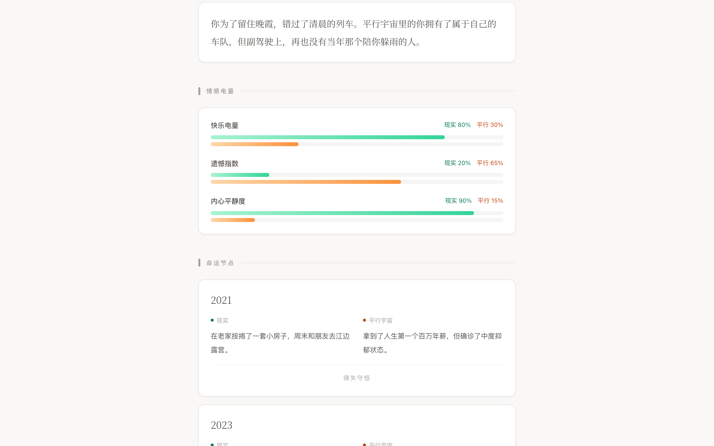
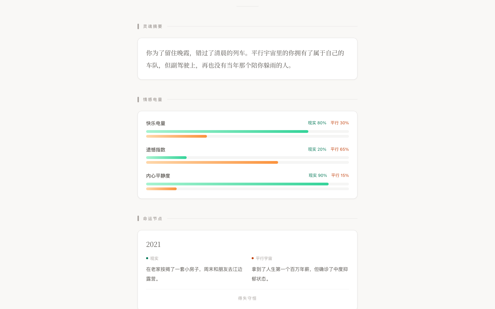
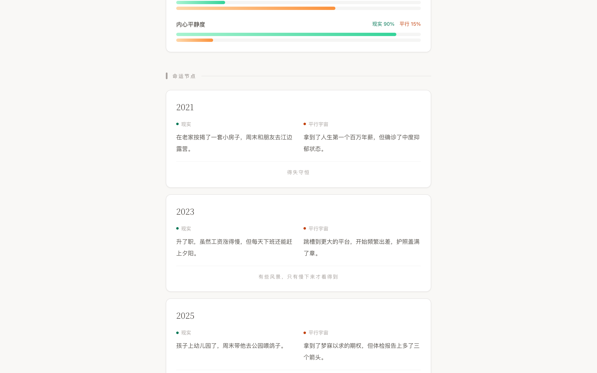
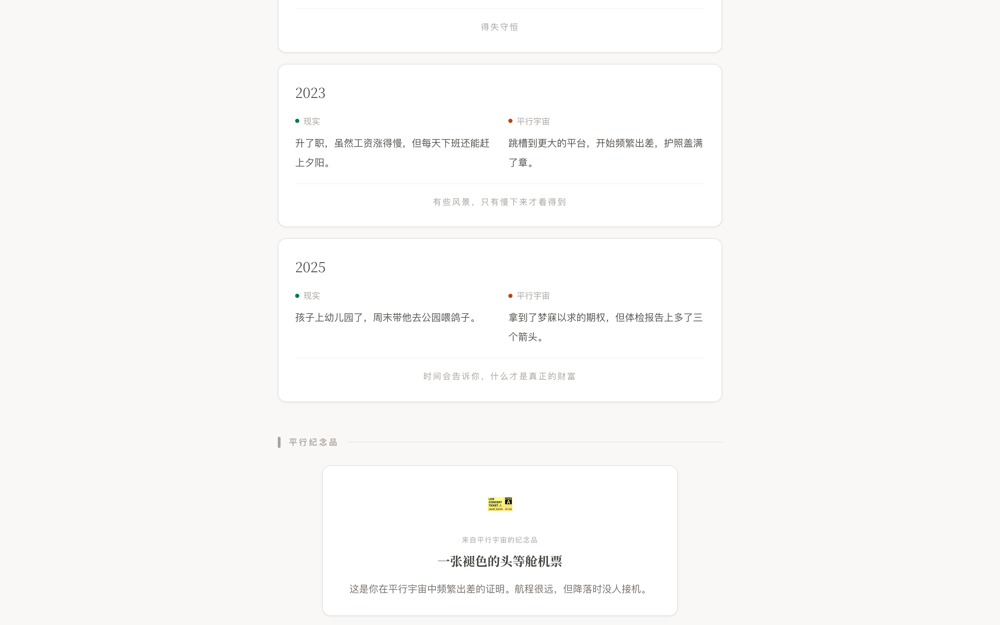
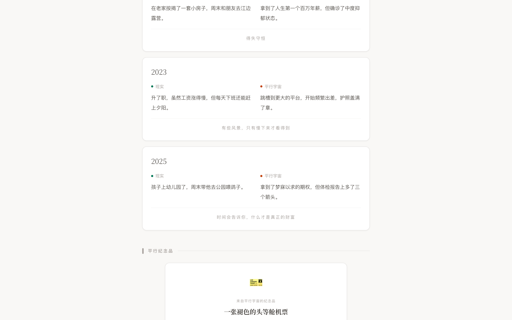
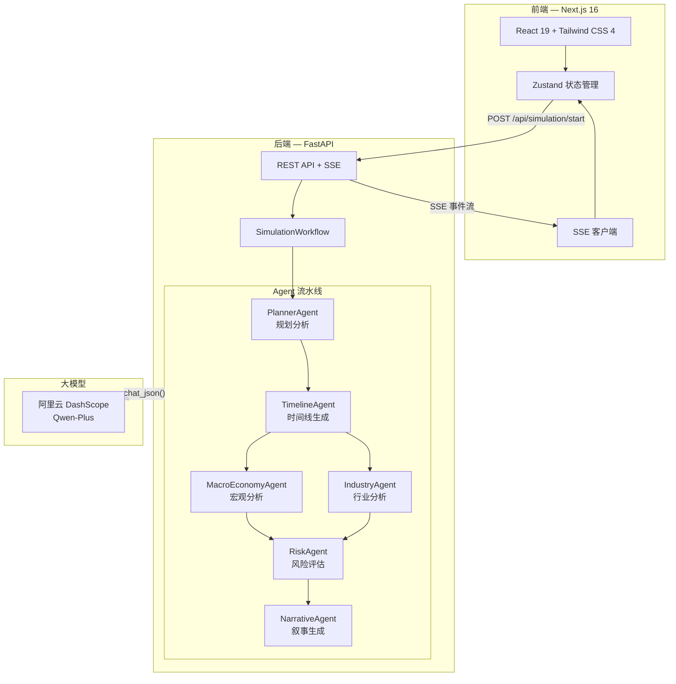

<div align="center">

# Hindsight — 后悔药

### 写给平行宇宙的信

<p>
  
  
  
  
  
  
</p>

<p>
  <strong>如果当初做了另一个选择，人生会怎样？</strong>
</p>
<p>
  一个由 6 个 AI Agent 驱动的平行宇宙人生模拟系统。<br/>
  输入你的人生遗憾，观看两条时间线缓缓展开——<br/>
  然后读一封来自另一个自己的信。
</p>

<br/>

<!-- HERO SCREENSHOT — 替换为实际截图 -->
<p>
  <em>在下方放置首页截图或 GIF 演示</em>
</p>

</div>

---

## 目录

- [功能亮点](#-功能亮点)
- [效果展示](#-效果展示)
- [系统架构](#-系统架构)
- [快速开始](#-快速开始)
- [项目结构](#-项目结构)
- [Agent 流水线](#-agent-流水线)
- [设计系统](#-设计系统)
- [API 文档](#-api-文档)
- [技术栈](#-技术栈)
- [路线图](#-路线图)
- [许可证](#-许可证)

---

## 功能亮点

**多 Agent 协作** — 6 个专职 Agent 组成流水线，从宏观经济学分析到情感叙事生成，各司其职。

**实时流式输出** — 基于 SSE (Server-Sent Events) 的实时事件流，用户可以亲眼看到每个 Agent 的思考过程。

**治愈系设计** — 告别冰冷的数据仪表盘。纸张质感、手写体、温暖的鼠尾草绿与赤土色，像翻开一本关于人生的杂志。

**情感数据可视化** — 不只是数字对比。快乐电量、遗憾指数、内心平静度，用感性的方式呈现理性分析。

**平行纪念品** — 每次推演都会生成一件来自平行宇宙的纪念品：一张褪色的机票、一封未寄出的信、一把生锈的钥匙……

**来自平行宇宙的信** — 那个做出了另一个选择的你，写给现在的你的一封信。这是整个系统最温暖的部分。

---

## 效果展示

### 输入表单 — 填写你的人生遗憾

<!-- 替换为实际截图 -->


> 温暖的填空式输入，像在写一封给自己的信。

### Agent 控制台 — 实时观看推演过程

<!-- 替换为实际截图 -->


> 6 个 Agent 依次启动，SSE 实时推送进度，每个 Agent 都有自己的状态和颜色。

### 灵魂摘要

<!-- 替换为实际截图 -->


> 一段温暖而深刻的洞察，像灵魂的低语。

### 情感电量

<!-- 替换为实际截图 -->


> 快乐电量、遗憾指数、内心平静度——用感性的方式量化两条时间线的情感差异。

### 命运节点

<!-- 替换为实际截图 -->


> 每个关键年份，现实与平行宇宙的对比。底部是诗意的分歧点标注。

### 平行纪念品

<!-- 替换为实际截图 -->


> 来自平行宇宙的一件小物件，承载着另一条人生的故事。

### 来自平行宇宙的信

<!-- 替换为实际截图 -->


> 那个做出了另一个选择的你，写给现在的你。这是整个推演中最温暖的时刻。

---

## 系统架构



### Agent 执行流程

```
用户输入 → Planner → Timeline → [MacroEconomy ‖ Industry] → Risk → Narrative → 结果组装
                ↓           ↓              ↓                    ↓          ↓
            分析维度     两条时间线      经济+行业环境       风险评估    情感叙事
                ↓           ↓              ↓                    ↓          ↓
              plan    timeline_data    macro_data +         risk_data   narrative_data
                                     industry_data                        ↓
                                                                  universe_state
                                                                        ↓
                                                              SSE → 前端渲染
```

---

## 快速开始

### 前置条件

- **Node.js** >= 18
- **Python** >= 3.11
- **阿里云 DashScope API Key** — [获取地址](https://dashscope.console.aliyun.com/)

### 1. 克隆项目

```bash
git clone https://github.com/your-username/hindsight-life.git
cd hindsight-life
```

### 2. 配置环境变量

```bash
cp .env.example .env
```

编辑 `.env`，填入你的 DashScope API Key：

```env
DASHSCOPE_API_KEY=sk-xxxxxxxxxxxxxxxxxxxxxxxx
NEXT_PUBLIC_API_URL=http://localhost:8000/api
```

### 3. 启动后端

```bash
cd apps/api

# 创建虚拟环境
python3 -m venv venv
source venv/bin/activate

# 安装依赖
pip install -r requirements.txt

# 启动 API 服务
uvicorn main:app --reload --port 8000
```

后端将在 `http://localhost:8000` 启动。API 文档访问 `http://localhost:8000/docs`。

### 4. 启动前端

```bash
cd apps/web

# 安装依赖
npm install

# 启动开发服务器
npm run dev
```

前端将在 `http://localhost:3000` 启动。

### 5. 开始使用

打开浏览器访问 `http://localhost:3000`，填写你的人生遗憾，然后等待 6 个 Agent 为你编织两个平行宇宙的故事。

### Docker（可选）

启动 Redis 和 PostgreSQL：

```bash
cd docker
docker-compose up -d
```

> **注意**：当前版本使用内存存储，Redis 和 PostgreSQL 尚未接入，仅作为后续扩展预留。

---

## 项目结构

```
Hindsight/
├── apps/
│   ├── api/                              # 后端 — Python FastAPI
│   │   ├── main.py                       # 应用入口
│   │   ├── config.py                     # Pydantic Settings 配置
│   │   ├── requirements.txt              # Python 依赖
│   │   ├── Dockerfile                    # Docker 构建文件
│   │   ├── agents/                       # 🤖 6 个 AI Agent
│   │   │   ├── base.py                   # Agent 基类
│   │   │   ├── planner.py                # 规划分析 Agent
│   │   │   ├── timeline.py               # 时间线生成 Agent
│   │   │   ├── macro_economy.py          # 宏观经济分析 Agent
│   │   │   ├── industry.py               # 行业趋势分析 Agent
│   │   │   ├── risk.py                   # 风险评估 Agent
│   │   │   └── narrative.py              # 叙事生成 Agent
│   │   ├── core/                         # 核心工具
│   │   │   ├── exceptions.py             # 自定义异常
│   │   │   └── logging.py                # 日志配置
│   │   ├── models/                       # Pydantic 数据模型
│   │   │   ├── events.py                 # Agent 事件模型
│   │   │   ├── scenario.py               # 遗憾场景模型
│   │   │   ├── timeline.py               # 时间线模型
│   │   │   └── universe.py               # 宇宙状态模型
│   │   ├── routers/                      # API 路由
│   │   │   ├── health.py                 # 健康检查
│   │   │   └── simulation.py             # 模拟接口（REST + SSE）
│   │   ├── services/                     # 外部服务
│   │   │   └── dashscope.py              # DashScope (Qwen) 封装
│   │   └── workflow/                     # 工作流编排
│   │       ├── graph.py                  # 模拟工作流主逻辑
│   │       └── state.py                  # 模拟状态管理
│   │
│   └── web/                              # 前端 — Next.js 16
│       ├── app/
│       │   ├── layout.tsx                # 全局布局 + 字体
│       │   ├── page.tsx                  # 主页面（三阶段切换）
│       │   └── globals.css               # 全局样式 + 设计系统
│       ├── components/
│       │   ├── portal/                   # 输入阶段
│       │   │   ├── MadLibsInput.tsx      # 填空式输入表单
│       │   │   └── PortalBackground.tsx  # 背景效果
│       │   ├── simulation/               # 推演阶段
│       │   │   └── AgentConsole.tsx      # Agent 进度控制台
│       │   ├── result/                   # 结果阶段
│       │   │   ├── ResultDashboard.tsx   # 结果主面板
│       │   │   ├── SummaryPanel.tsx      # 灵魂摘要
│       │   │   ├── RadarChart.tsx        # 情感电量条
│       │   │   ├── NodeComparison.tsx    # 命运节点卡片
│       │   │   ├── InventorySection.tsx  # 平行纪念品
│       │   │   └── FutureLetter.tsx      # 来自平行宇宙的信
│       │   └── ui/                       # 基础 UI 组件
│       ├── hooks/
│       │   ├── useSimulation.ts          # 模拟生命周期管理
│       │   └── useSSE.ts                 # SSE 客户端 Hook
│       ├── lib/
│       │   ├── api.ts                    # REST API 客户端
│       │   ├── sse.ts                    # SSE 客户端封装
│       │   ├── adapter.ts                # 数据适配器（后端 → 前端）
│       │   └── utils.ts                  # 工具函数
│       ├── stores/
│       │   └── simulation.ts             # Zustand 状态管理
│       └── types/
│           └── index.ts                  # TypeScript 类型定义
│
├── docker/
│   └── docker-compose.yml                # Redis + PostgreSQL
├── docs/
│   └── screenshots/                      # README 截图
├── .env.example                          # 环境变量模板
├── .gitignore
├── install-deps.sh                       # 一键安装前端依赖
└── start-dev.sh                          # 一键启动前端开发服务器
```

---

## Agent 流水线

每个 Agent 继承 `BaseAgent`，通过 `execute()` 异步生成器产出 `AgentEvent`，经由 SSE 实时推送到前端。

| # | Agent | 职责 | 输入 | 输出 |
|---|-------|------|------|------|
| 1 | **PlannerAgent** | 分析遗憾场景，识别分析维度（职业、财务、生活方式、关系） | 用户输入的场景 | 分析计划 |
| 2 | **TimelineAgent** | 生成两条平行时间线（现实 + 假设），各 5-8 个关键节点 | 场景 + 计划 | 时间线数据 |
| 3 | **MacroEconomyAgent** | 分析宏观经济环境（GDP、房价、薪资趋势、黑天鹅事件） | 场景 + 计划 | 宏观数据 |
| 4 | **IndustryAgent** | 对比两条时间线的行业发展趋势 | 场景 + 计划 | 行业数据 |
| 5 | **RiskAgent** | 评估两条时间线的风险与隐藏机会 | 全部前置数据 | 风险评估 |
| 6 | **NarrativeAgent** | 生成治愈系叙事：灵魂摘要、情感电量、平行纪念品、未来信件 | 全部前置数据 | 叙事数据 |

> **并行优化**：MacroEconomyAgent 和 IndustryAgent 通过 `asyncio.gather` 并行执行，减少总等待时间。

### 数据流转

```python
# workflow/graph.py — 核心编排逻辑
async for event in self.planner.execute({"scenario": scenario}):    # Phase 1
    yield event

async for event in self.timeline.execute(context):                   # Phase 2
    yield event

await asyncio.gather(collect_macro(), collect_industry())            # Phase 3 (并行)

async for event in self.risk.execute(context):                       # Phase 4
    yield event

async for event in self.narrative.execute(context):                  # Phase 5
    yield event

state.universe_state = self._build_universe_state(state)             # 组装最终结果
```

---

## 设计系统

### V4.0 治愈系人文风

告别暗黑赛博朋克，拥抱纸张质感与信件温度。

| 元素 | 值 | 用途 |
|------|-----|------|
| 背景色 | `#F9F8F6` | 页面底色，米白纸张感 |
| 主文本 | `stone-800` | 正文、标题 |
| 现实色 | `emerald-700` | 现实时间线标识 |
| 平行色 | `orange-700` | 平行宇宙标识 |
| 标题字体 | Noto Serif SC | 有文学感的衬线体 |
| 正文字体 | 系统 sans-serif | 清晰易读 |
| 卡片样式 | `.paper-card` | 白色背景 + 细边框 + 微阴影 |

### 色彩语义

```
现实时间线  →  鼠尾草绿 (emerald)  →  温暖、安定、踏实
平行宇宙   →  赤土色 (orange)     →  热烈、冒险、未知
情感数据   →  暖灰 (stone)        →  克制、优雅、不喧宾夺主
背景       →  米白 (#F9F8F6)      →  纸张、日记、信件
```

---

## API 文档

### 启动模拟

```
POST /api/simulation/start
```

**Request Body:**
```json
{
  "scenario": {
    "choice_point": "2018年放弃了腾讯的offer",
    "time_node": "2018年夏天",
    "alternative": "接受offer去深圳发展",
    "current_state": "在成都一家小公司做产品经理，月薪1.5万"
  },
  "depth": 5,
  "include_narrative": true
}
```

**Response:**
```json
{
  "simulation_id": "uuid",
  "status": "pending",
  "stream_url": "/api/simulation/uuid/stream"
}
```

### SSE 事件流

```
GET /api/simulation/{id}/stream
```

**事件格式:**
```
event: agent_event
data: {
  "event_type": "agent_progress",
  "agent": "timeline",
  "status": "generating",
  "message": "正在生成时间线...",
  "data": {...}
}
```

**事件类型:**
- `agent_start` — Agent 开始工作
- `agent_progress` — Agent 进度更新
- `agent_complete` — Agent 完成（携带结果数据）
- `narrative_chunk` — 叙事片段（用于流式展示）
- `simulation_complete` — 整个模拟完成（携带最终数据）

### 获取事件历史

```
GET /api/simulation/{id}/events
```

返回该模拟的所有已产生事件（轮询降级方案）。

---

## 技术栈

<table>
<tr>
<td><strong>前端</strong></td>
<td>
  <a href="https://nextjs.org/">Next.js 16</a> (App Router) ·
  <a href="https://react.dev/">React 19</a> ·
  <a href="https://tailwindcss.com/">Tailwind CSS 4</a> ·
  <a href="https://www.framer.com/motion/">Framer Motion</a> ·
  <a href="https://zustand-demo.pmnd.rs/">Zustand</a> ·
  <a href="https://tanstack.com/query">TanStack Query</a> ·
  <a href="https://echarts.apache.org/">ECharts</a>
</td>
</tr>
<tr>
<td><strong>后端</strong></td>
<td>
  <a href="https://fastapi.tiangolo.com/">FastAPI</a> ·
  <a href="https://docs.pydantic.dev/">Pydantic v2</a> ·
  <a href="https://help.aliyun.com/zh/dashscope/">DashScope (Qwen)</a> ·
  <a href="https://sse-starlette.readthedocs.io/">SSE-Starlette</a> ·
  <a href="https://www.uvicorn.org/">Uvicorn</a>
</td>
</tr>
<tr>
<td><strong>基础设施</strong></td>
<td>
  <a href="https://www.docker.com/">Docker</a> ·
  <a href="https://redis.io/">Redis</a> (预留) ·
  <a href="https://www.postgresql.org/">PostgreSQL</a> (预留)
</td>
</tr>
<tr>
td><strong>大模型</strong></td>
<td>
  阿里云 DashScope ·
  Qwen-Plus (默认) ·
  支持切换任意 DashScope 兼容模型
</td>
</tr>
</table>

---

## 路线图

- [x] **Phase 1** — 核心功能：6-Agent 流水线 + SSE 流式输出 + 治愈系 UI
- [ ] **Phase 2** — 持久化：Redis 状态存储 + PostgreSQL 历史记录
- [ ] **Phase 3** — 分享功能：生成可分享的结果卡片 + OG 图片
- [ ] **Phase 4** — 多模态：语音输入 + AI 配图生成
- [ ] **Phase 5** — 社交：匿名社区 + "同一条路的人" 匹配

---

## 许可证

MIT License

---

<div align="center">

**每条路都有自己的风景。**

*照顾好现在的自己，那就是我们最好的结局。*

—— 另一个时空的你

</div>
